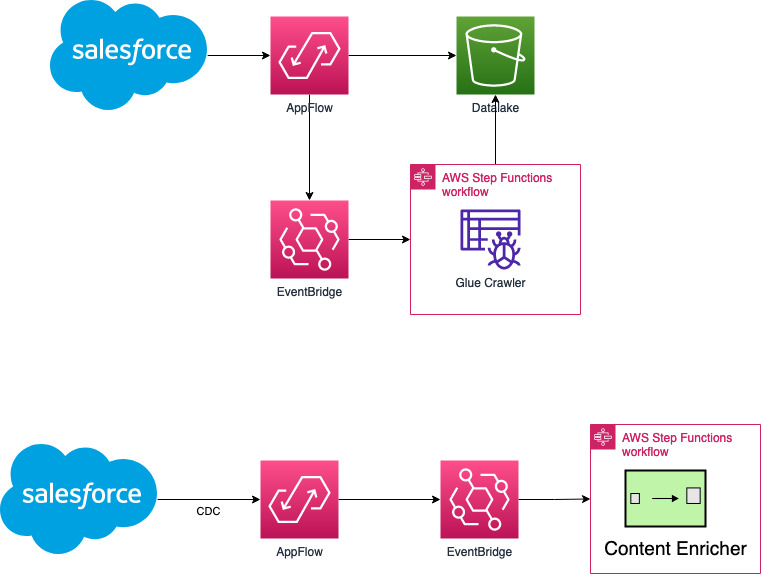

  # Datalake Hydration and Content Enrichment 
   

  This template will create a set of resources:

    * Amazon AppFlow batch flow to fetch data from Salesfroce to S3. 
  
    * Amazon AppFlow event flow to listen for CDC changes and propagate this to EventBridge. 

  **Installation Guide:**
  
  1. Create Salesforce connector profile in Amazon AppFlow
  2. Launch this template and wait until finish. 
  3. Go to Amazon Athena and setup Athena S3 bucket.
  4. Launch Amazon AppFlow batch flow - this will populate your datalake and trigger Glue Crawler to craw the data. 
  5. Go to EventBridge and associate the partner event bus 
  6. Go to Amazon AppFlow and activate the event driven flow. 
  7. Login to SFDC and edit a record. 

    7.1) Verify the CDC AppFlow is executed. 

    7.2) Verify the CDC StepFunction is executed. If this is not happening, you may need to recreate the EventBridge Rule for the partner event bus manually - I think there is a defect in CFN creating partner event rule. 

**IMPORTANT!!!**

  * If Athena Query doesn't work, please edit the Step Function and check if the CFN template have generated correct database and table name in the SQL query! Somtimes this could be tricky if the CFN Stack name has capital letters etc. 
  
  * If the Partner EventBridge Rule doesn't work and does not propagate events, please recreate manually.

  * This CFN template will allow the CDC StepFunction to send SQS message to **ALL** queues! You may want to recify this following least privilege!.
